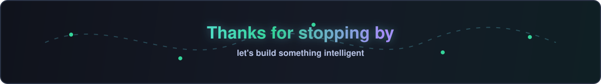

<!-- ════════════════════════ HERO ════════════════════════ -->

  

  
  
  

## 🧑‍💻 whoami

  

Software Developer with **2 years building AI integrated systems end-to-end**.

- 🎓 **MSc in Artificial Intelligence** @ **Nanyang Technological University, Singapore** - College of Computing and Data Science *(Aug 2026 - Jun 2027)*

- 🔬 Exploring **Agentic AI**, **RAG**, **Natural Language Processing**, **ML**, and **Deep Learning**

> **📌 Seeking Singapore-based internships alongside the MSc:** **16 h/week during term** (classes run evenings) and **full-time during vacations**, under MOM's student work-pass exemption - **no separate work pass required**.

## 🚀 The Journey

  

## 💼 Experience

### Lead Software Developer · *Jun 2024 - Jun 2026*
**Curer** · Delhi, India

- Led a team of **5 developers** to architect and deploy AI-driven healthcare features using Next.js, TypeScript, and
Python on AWS, **serving 200+ active users**.

- Orchestrated context-aware AI chatbot using LangChain and LangGraph, reducing query **response times by 30%** and **processing 50+ clinical queries** daily.

- Streamlined clinical records ingestion by integrating ElevenLabs speech-to-text API, cutting document processing time across **100+ uploaded records**.

- Managed AWS cloud infrastructure (EC2, Amplify) and automated CI/CD deployment pipelines.

### Google Summer of Code · *May 2024 - Oct 2024*
**Integrated Ocean Observing System (IOOS)**  · Delhi, India

- Enhanced Python-based quality control libraries for scientific oceanographic datasets.

- Developed automated validation tooling for time-series analysis.

- Published 2 comprehensive technical guides and Jupyter Notebook workflows, accelerating onboarding for 200+ community open-source developers.

## 🛠️ Tech Stack

**Languages**

*Python · Java · JavaScript · TypeScript*

 

**ML / AI**

*LangChain · LangGraph · OpenAI API · LLMs · Generative AI · Prompt Engineering · Tensorflow · FAISS · OpenCV*

 

**MLOps & Infrastructure**

*AWS (Amplify, EC2, S3) · Docker · Jira · Git · FastAPI · Bitbucket · CI/CD*

 

**Backend / Data**

*Next.js · React · Node.js · Django REST · AngularJS · PostgreSQL · Redis · Firebase*

## 💡 Projects

| Project | What it does |
|---|---|
| 🏦 **[Accord](https://github.com/Sakshamgupta90/accord)** -    *TypeScript, Node.js, CopilotKit Channels, Slack, OpenAI Responses API, Trigger.dev, PostgreSQL, ClickHouse* | Slack-native decision intelligence agent that detects when a team decision changes expected software behavior, investigates the relevant repository and data impact, and reports evidence back into the originating Slack thread. Built around strict shared contracts, durable state, repository investigation, privacy-safe logging, and verification workflows for changed decisions and proposed fixes. |
| 🏈 **[DocuMate](https://github.com/Sakshamgupta90/DocuMate)**   *Python, Streamlit, LangChain, FAISS, OpenAI, PyPDF2* | RAG-based PDF chatbot that lets users upload documents, extracts and chunks PDF text, embeds it into a local FAISS vector index, and answers questions using retrieved context with conversational memory. Uses LangChain retrieval chains, OpenAI embeddings/chat models, and a Streamlit interface for an interactive document Q&A flow. |
| 🧩 **[CyberWatch - Network Intrusion Detection](https://github.com/Sakshamgupta90/CyberWatch)**   *Python, Flask, TensorFlow/Keras, pandas, NumPy, HTML/CSS/JavaScript* | Hybrid intrusion detection system for classifying network traffic as benign or intrusive. Provides a Flask web app for uploading CIC Flow Meter CSV/PCAP-derived traffic data, a separate Flask prediction API, feature preprocessing with a saved scaler, and TensorFlow/Keras model inference with confidence scores displayed in a results page. |
|

## 🎓 Education

| | |
|---|---|
| **Nanyang Technological University (NTU), Singapore**   MSc in Artificial Intelligence, College of Computing and Data Science | *Aug 2026 - Present*   Singapore |
| **Maharaja Agrasen Intitute of Technology (MAIT)**   B.Tech, Information Technology | *2020 - 2024*   Delhi, India |

## 🤖 Hackathons

| Hackathon | What I Built | Link |
|---|---|---|
| Agents, Everywhere powered by OpenAI | **Accord** - Slack-native agent that detects decision changes, investigates repo/data impact, and reports evidence back in-thread.  | [GitHub](https://github.com/Sakshamgupta90/accord) |
| Daytona | Built **MCP-Forge**, a multi-agent compiler that turns API specs or cURL requests into MCP servers with generated test harnesses, Daytona sandbox deployment, automated functional testing, and red-team security checks.  | [GitHub](https://github.com/Sakshamgupta90/daytona-hackathon) |
| NUS-ISS Show Me Your Agents 2026 | Built **AutoDiagnose AI**, an agentic vehicle fault diagnosis copilot using RAG over automotive fault data and diagnostic flowcharts, with multimodal inputs, VIN/OBD-II context, LLM fallback for unseen faults, and feedback-driven knowledge updates. | [GitHub](https://github.com/Sakshamgupta90/AutoDiagnoseAI) |

## 🤝 Let's Connect

  
  
  

<!-- ════════════════════════ FOOTER ════════════════════════ -->

  

